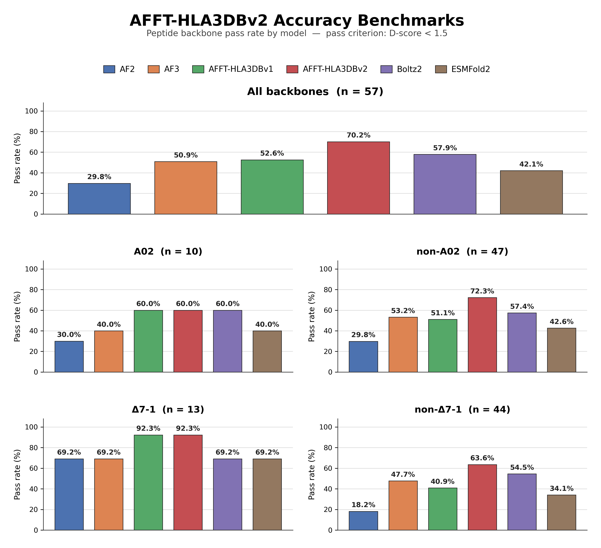

# Alphafold Finetune HLA3db
This repository contains scripts for the prediction of HLA class I / 9-mer peptide complexes with fine-tuned AlphaFold weights. Inputted target sequences are screened against a library of candidate template structures from HLA3DB - the pipeline picks templates per target, runs deterministic AlphaFold inference on a SLURM cluster, and collects the resulting PDBs.

For methods related to HLA3DB (hla3db.research.chop.edu) refer to Gupta, S., Nerli, S., Kutti Kandy, S. et al. HLA3DB: comprehensive annotation of peptide/HLA complexes enables blind structure prediction of T cell epitopes. Nat Commun 14, 6349 (2023). https://doi.org/10.1038/s41467-023-42163-z

```
Copyright (c) 2026 The Children's Hospital of Philadelphia and Stanford University
Licensed for academic and non-commercial use only. Commercial use requires a
separate license. See LICENSE for details.
```

Methods used to finetune and Benchmark Results are included below. For scripts used to finetune our installation please refer to the Finetuning branch of the repository. 

## Requirements
- afft-hla3db conda env
- A GPU for inference (the driver's sequential mode runs on whatever node it
  lands on; `--parallel` requests `gpu:1` per job)
- SLURM, if you use the shell drivers
- A fine-tuned parameter pickle (e.g. `affthla3db.pkl`)

## Setup and Runtime Options
1. Clone this repository 
```bash
git clone https://github.com/rampantula/afft_hla3dbv2
cd afft-hla3dbv2
```
2. Download the parameters from https://zenodo.org/records/22664552 and move the file into the "afft-hla3dbv2" directory

3. Create the conda environment on your local installation
```bash
conda env create -f afft_environment.yml 
```
4. Populate input_seq/ with {target}_seq.txt files
Line 1: MHC sequence (180 bp)
Line 2: peptide sequence (9 bp)

5. Run fold.sh 
Singular Mode - All inferences sequentially on one node:
```bash
sbatch fold.sh
```
Parallel Mode - One GPU job per target:
```bash
sbatch fold.sh --parallel
```

6. After the process runs you can also flatten results and collect the pdbs using:
```bash
python store.py     # outfiles/<target>/outputs/<target>_model_split.pdb -> MHC_pdbs/<target>.pdb
```

## Fine-tune Methods and Benchmarking 

Performance of AFFT-HLA3DBv2 (this repo) against previous fine-tuned models and current state-of-the-art prediction models, with emphasis on peptide conformational accruacy.
AFFT-HLA3DBv2 provides greatest advantage over other models in non-A02 and non ∆7-1 backbone targets. 

AFFT-HLA3DBv2 was finetuned using training template selection on structures HLA3DB published before 2023 and validated and tested on structures published after 2023.
For each target, every template is scored on two axes:

- **MHC**: global Needleman–Wunsch alignment (BLOSUM62, gap open −11, extend −1) via Biopython's `PairwiseAligner`, giving an alignment score, a
  residue-level target→template mapping, and a percent identity.
- **Peptide**: summed BLOSUM62 score over the nine positions, plus a Hamming mismatch count.

Both scores are min-max normalized across the surviving candidates for that target, then combined as `mhc_weight * norm_mhc + peptide_weight * norm_peptide`
(weights are renormalized to sum to 1; defaults 0.3 / 0.7). The top N are kept.
By default only one template per base PDB ID is allowed, so `6PTE-AC` blocks `6PTE-DF`. A template whose ID equals the target ID is always excluded, and a
trailing `_reordered` on a template filename is stripped before that comparison.

Selected templates were predicted and utilized both Alphafold loss functions as well as a secondary d-score based loss function to prioritize peptide backbone accuracy.

## Pipeline Overview 
### Contents

| File | Role |
| --- | --- |
| `fold.sh` | Driver. Builds inputs, then runs or submits predictions. |
| `initialize.py` | Template selection + per-target input generation. |
| `predict_structure.sh` | Per-target SLURM GPU worker (used when submitted through `--parallel`). |
| `run_prediction.py` | AlphaFold inference, PDB splitting, D-score / pLDDT / PAE metrics. |
| `predict_utils.py` | PDB reading, template featurization, model runner setup. |
| `train_utils.py` | Feature-key lists and atom/frame helpers shared with the fine-tuning code. |
| `store.py` | Collects final per-target PDBs into one flat directory. |

### Stage 0 - Input and Prediction submissions

Run from a working directory containing:

```
input_seq/            <target_id>_*.txt   line 1 = MHC sequence, line 2 = 9-mer peptide
template_pdbs/        *.pdb               chain A = MHC, chain B = 9-mer peptide
affthla3db.pkl                            fine-tuned AlphaFold parameters
logs/                                     must exist; SLURM writes here
```

The target ID is the text before the first underscore in the sequence filename.
Template sequences are read straight out of the ATOM/HETATM records — no
separate template sequence file is needed. Templates whose chain B is not a
9-mer, or that are missing chain A or B, are skipped with a warning. Targets
with non-9-mer peptides are skipped too.

The knobs at the top of `fold.sh` (`INPUT_SEQ_DIR`, `TEMPLATE_PDB_DIR`,
`TARGETS_ROOT`, `PARAMS_FILE`, `MODEL_NAME`) are meant to be edited in place.
`GENERATE_ARGS` is forwarded to `initialize.py` and `EXTRA_ARGS` to
`run_prediction.py`, e.g.:

```bash
GENERATE_ARGS="--top-n 6 --min-peptide-mismatches 2"
EXTRA_ARGS="--num_recycle 3 --resample_msa"
```

### Stage 1 — `initialize.py`
Useful flags:

| Flag | Default | Effect |
| --- | --- | --- |
| `--top-n` | 4 | Templates written per target |
| `--mhc-weight` / `--peptide-weight` | 0.3 / 0.7 | Score weighting |
| `--min-peptide-mismatches` | 0 | Drop templates *more* similar than this |
| `--max-mhc-identity` | 1.0 | Drop templates above this MHC identity |
| `--disable-peptide-mismatch-filter`, `--disable-mhc-identity-filter` | off | Skip the corresponding filter |
| `--allow-same-pdb-multiple-times` | off | Permit several chain pairs from one PDB |
| `--allow-fewer-than-top-n` | off | Continue instead of exiting when filters leave too few |
| `--write-debug-scores` | off | Write `debug_scores.tsv` with every candidate, ranked |
| `--allele-name`, `--start` | `A*02:01`, 0 | Literal values for those `target.tsv` columns |

The mismatch and identity filters exist mainly for held-out benchmarking, where
you want to exclude templates that are too close to the answer. Note that
`--allele-name` is written verbatim and is *not* derived from the sequence, so
it is wrong for any run that isn't A\*02:01 — nothing downstream reads it for
modeling, but don't trust it as metadata.

Output per target:

```
outfiles/<target_id>/inputs/target.tsv
outfiles/<target_id>/inputs/alignments.tsv
outfiles/<target_id>/inputs/templates/<template_id>.pdb
outfiles/<target_id>/inputs/debug_scores.tsv        (optional)
```

`target.tsv` carries `mhc`, `start`, `peptide`, `targetid`, `target_chainseq`
(MHC and peptide joined by `/`), and `templates_alignfile`. `alignments.tsv`
carries `template_pdbfile`, `target_to_template_alignstring` (`i:j;i:j;...`),
`identities`, `target_len`, `template_len`. Peptide residues are mapped
positionally 1:1, since everything is a 9-mer.

If filtering leaves fewer than `--top-n` templates for any target, the script
exits with an error rather than silently under-templating. Pass
`--allow-fewer-than-top-n` to override.

### Stage 2 — `run_prediction.py`

```bash
python run_prediction.py \
    --targets <target.tsv or targets root dir> \
    --params_file affthla3db.pkl \
    --outfile_prefix <name> \
    --output_dir <dir> \
    --model_name model_2_ptm \
    --verbose
```

`--targets` accepts either a single TSV or a root directory, in which case all
`*/inputs/target.tsv` files are concatenated and relative `templates_alignfile`
paths are resolved against that root.

The MSA is the query sequence alone; structural information comes entirely from
the templates. Crop size defaults to the longest target unless `--crop_size` is
given, and a target longer than the crop is an error. Each target gets a seed
derived from `--seed` and its target ID, so results depend on the target, not on
row order in the TSV.

Model-config overrides: `--msa_clusters` (5), `--extra_msa` (1),
`--num_evo_blocks` (48), `--num_recycle`, `--struc_viol_weight`,
`--resample_msa`.

Outputs into `--output_dir`:

- `<prefix>_<target>_model_*.pdb` — raw AlphaFold output
- `<target>_model_split.pdb` — same model re-chained into MHC (A) and peptide (B) with per-chain residue numbering; this is what `store.py` collects
- `<prefix>_final.tsv` — one row per target with the input columns plus `<model>_plddt`, per-chain pLDDT, `<model>_pae` and per-chain-pair PAE, `<model>_dscore`, `<model>_dscore_similar`, and paths to both PDBs
